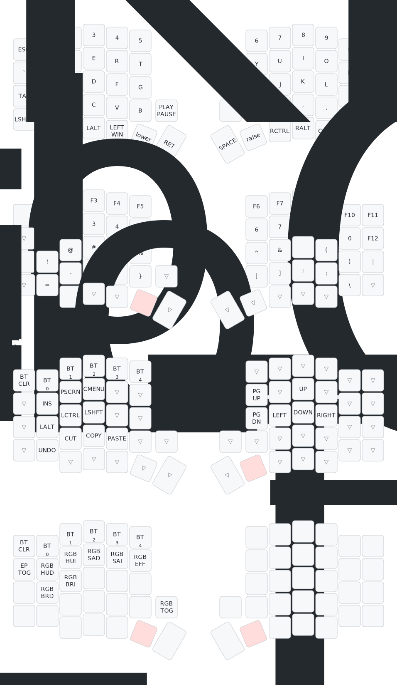

# Sofle Choc Keyboard
The Sofle Choc keyboard is 6×4+5 keys column-staggered split keyboard, using Kailh Choc switches. It uses a Nice!Nano microcontroller and runs the ZMK firmware.

## Default keymap
The default keymap of this keyboard can be found here:
